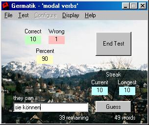



## Germatik \- learn vocabulary lists

### Description

This is a fully functional program designed to help in the study of vocabulary lists in German. I was doing poorly on my vocabulary tests, but after using this program, I passed every one with flying colors.

Included are several lists of words, and you can easily create your own with the built-in ListEditor.

There are also many modules of code to access list boxes, manipulate strings, etc. You could download the program just for those.

This program started out two years ago as a text only program in GW-BASIC. At the time, that was all I knew how to do. It was a pain to change the list of words. Since then, the program has grown considerably. You can easily add words, change words and even look up the correct article for nouns (der/die/das)! It even gives you a score at the end of the test!
 
### More Info
 
Sorry, but there is no user documentation. It shouldn't be hard to figure out anyway.

The only side effect is that you may find yourself passing vocabulary tests!

             |
---                |---
**Submitted On**   |2002-04-28 19:24:30
**By**             |[Aaron Parecki](https://github.com/Planet-Source-Code/PSCIndex/blob/master/ByAuthor/aaron-parecki.md)
**Level**          |Intermediate
**User Rating**    |5.0 (30 globes from 6 users)
**Compatibility**  |VB 5\.0, VB 6\.0
**Category**       |[Complete Applications](https://github.com/Planet-Source-Code/PSCIndex/blob/master/ByCategory/complete-applications__1-27.md)
**World**          |[Visual Basic](https://github.com/Planet-Source-Code/PSCIndex/blob/master/ByWorld/visual-basic.md)
**Archive File**   |[Germatik\_\-777664302002\.zip](https://github.com/Planet-Source-Code/aaron-parecki-germatik-learn-vocabulary-lists__1-34266/archive/master.zip)

### API Declarations

Some, but nothing out of the ordinary.

